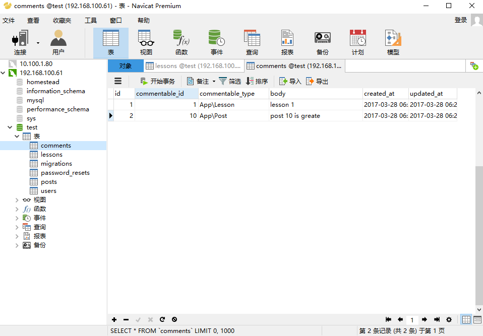

#Eloquent 多态关联

php artisan make:model Lesson -m

2017_03_28_055417_create_lessons_table.php
```
public function up()
{
    Schema::create('lessons', function (Blueprint $table) {
        $table->increments('id');
        $table->string('title');
        $table->timestamps();
    });
}
```

php artisan migrate

ModelFactory.php
```
/** @var \Illuminate\Database\Eloquent\Factory $factory */
$factory->define(App\Lesson::class, function (Faker\Generator $faker) {
    return [
        'title' => $faker->sentence,
    ];
});
```

php artisan tinker
namespace App
factory(Lesson::class, 10)->create()

php artisan make:model Comment -m
php artisan migrate

Comment.php
```
/**
 * @return \Illuminate\Database\Eloquent\Relations\MorphTo
 */
public function commentable(){
    return $this->morphTo();
}
```

Lesson.php
```
/**
 * @return \Illuminate\Database\Eloquent\Relations\MorphMany
 */
public function comments(){
    return $this->morphMany(Comment::class, 'commentable');
}
```

Post.php
```
/**
 * @return \Illuminate\Database\Eloquent\Relations\MorphMany
 */
public function comments(){
    return $this->morphMany(Comment::class, 'commentable');
}
```

php artisan tinker
namespace App
$lesson = Lesson::find(1)
$lesson->unguard()
$lesson->comments()->create(['body'=>'lesson 1'])

$post = Post::find(10)
$post->unguard()
$post->comments()->create(['body'=>'post 10 is greate'])



php artisan tinker
namespace App;
$lesson = Lesson::find(1)
$lesson->comments->toArray()

$post = Post::find(10)
$post->comments->toArray()

$comment = Comment::find(1)
$comment->commentable

$comment = Comment::find(2)
$comment->commentable