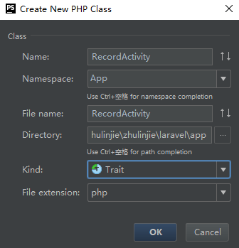
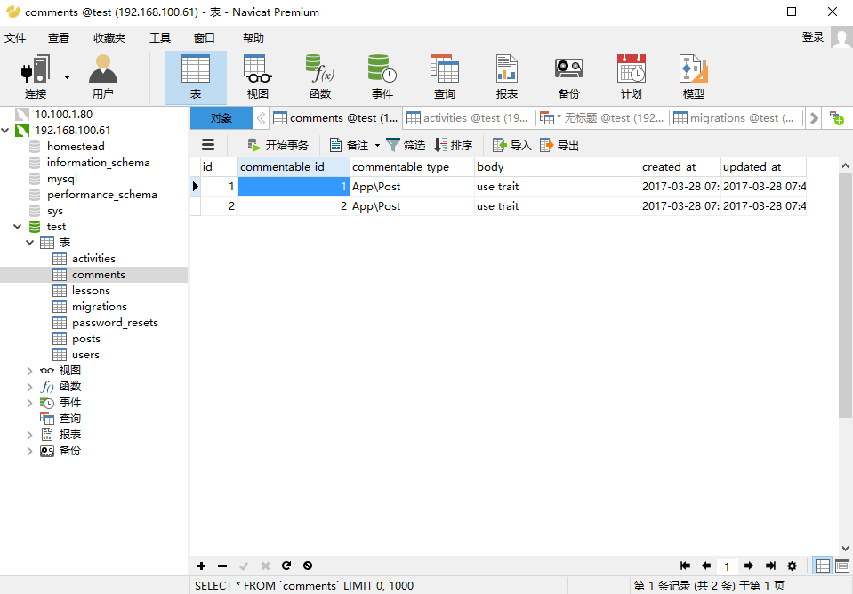
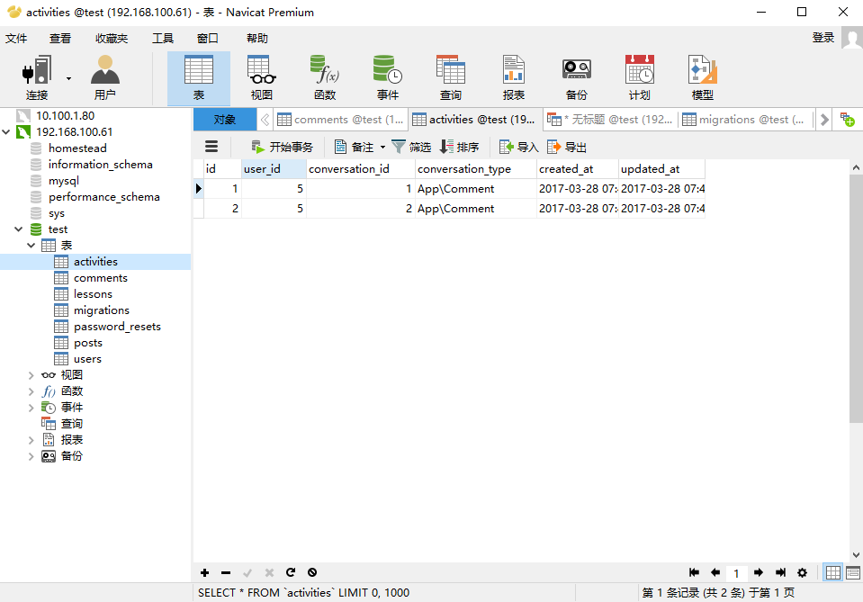
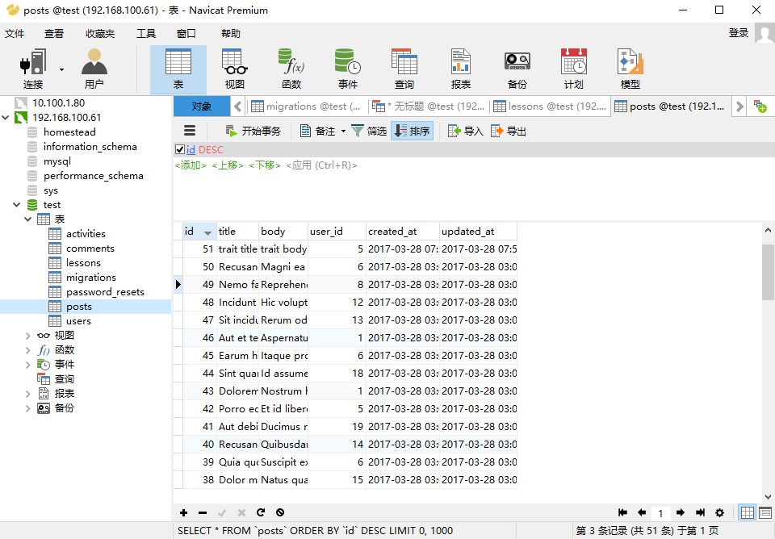
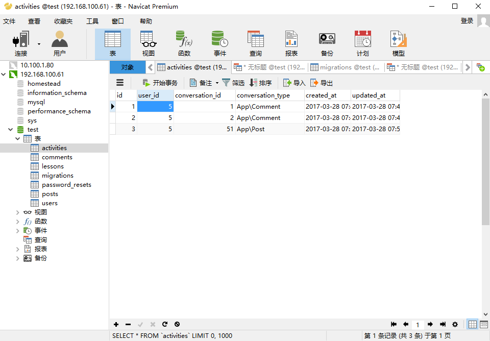
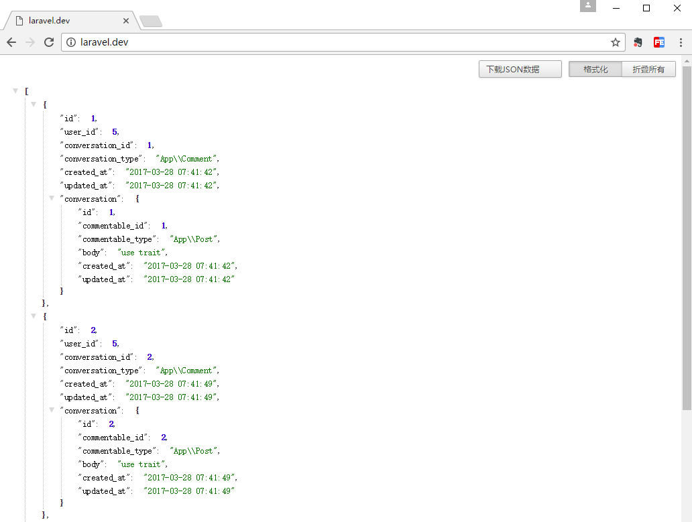

#Eloquent 模型事件应用

利用Eloquent Model的多态关联还有它的事件去完成一个记录用户活动的功能
参照：[https://www.laravist.com/user/daryl](https://www.laravist.com/user/daryl)  

php artisan make:model Activity -m

2017_03_28_065132_create_activities_table.php
```
public function up()
{
    Schema::create('activities', function (Blueprint $table) {
        $table->increments('id');
        $table->integer('user_id');
        $table->integer('conversation_id');
        $table->string('conversation_type');
        $table->timestamps();
    });
}
```

php artisan migrate

Activity.php
```
/**
 * @var array
 */
protected $fillable = ['user_id', 'conversation_id', 'conversation_type'];

/**
 * @return \Illuminate\Database\Eloquent\Relations\MorphTo
 */
public function conversation(){
    return $this->morphTo();
}

/**
 * @return \Illuminate\Database\Eloquent\Relations\BelongsTo
 */
public function user(){
    return $this->belongsTo(User::class);
}
```

User.php
```
/**
 * @return \Illuminate\Database\Eloquent\Relations\HasMany
 */
public function activities(){
    return $this->hasMany(Activity::class);
}
```



app/RecordActivity.php
```
<?php

namespace App;

trait RecordActivity
{
    public static function bootRecordActivity()
    {
        foreach (static::getModelEvents() as $event) {
            static::$event(function($model){
                $model->recordActivity();
            });
        }
    }

    public function recordActivity()
    {
        Activity::create([
            'user_id' => \Auth::id(),
            'conversation_id' => $this->id,
            'conversation_type' => get_class($this),
        ]);
    }

    public static function getModelEvents()
    {
        if(isset(static::$recordEvents)){
            return static::$recordEvents;
        }

        return ['created'];
    }
}
```

Comment.php
```
class Comment extends Model
{
    use RecordActivity;

    protected $fillable = ['body'];

    /**
     * @return \Illuminate\Database\Eloquent\Relations\MorphTo
     */
    public function commentable(){
        return $this->morphTo();
    }
}
```

web.php
```
Auth::loginUsingId(5);

Route::get('/', function () {
//    $post = \App\Post::find(1);
    $post = \App\Post::find(2);
    $comment = $post->comments()->create(['body'=>'use trait']);
    return $comment;
});
```
打开浏览器运行一下





User.php
```
/**
 * @return \Illuminate\Database\Eloquent\Relations\HasMany
 */
public function activities(){
    return $this->hasMany(Activity::class)->with('conversation');
}
```

web.php
```
Auth::loginUsingId(5);

Route::get('/', function () {
//    $post = \App\Post::find(1);
//    $post = \App\Post::find(2);
//    $comment = $post->comments()->create(['body'=>'use trait']);
//    return $comment;

    $user = Auth::user();
    $activities = $user->activities;
    return $activities;
});
```

Post.php
```
use RecordActivity;

/**
 * @var array
 */
protected $fillable = ['title', 'body', 'user_id'];

/**
 * @return \Illuminate\Database\Eloquent\Relations\MorphMany
 */
public function comments(){
    return $this->morphMany(Comment::class, 'commentable');
}
```

web.php
```
Auth::loginUsingId(5);

Route::get('/', function () {
//    $post = \App\Post::find(1);
//    $post = \App\Post::find(2);
//    $comment = $post->comments()->create(['body'=>'use trait']);
//    return $comment;

//    $user = Auth::user();
//    $activities = $user->activities;
//    return $activities;

    $post = \App\Post::create([
        'user_id' => Auth::id(),
        'title' => 'trait title',
        'body' => 'trait body'
    ]);
    return $post;
});
```
打开浏览器运行一下





web.php
```
Auth::loginUsingId(5);

Route::get('/', function () {
//    $post = \App\Post::find(2);
//    $comment = $post->comments()->create(['body'=>'use trait']);
//    return $comment;

//    $post = \App\Post::create([
//        'user_id' => Auth::id(),
//        'title' => 'trait title',
//        'body' => 'trait body'
//    ]);
//    return $post;

    $user = Auth::user();
    $activities = $user->activities;
    return $activities;
});
```
打开浏览器运行一下

